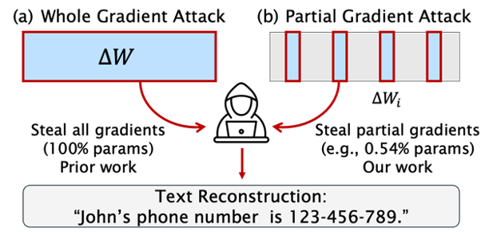

# Data Leakage from Partial Transformer Gradients

This is the project for: [To-be-updated (arXiv link)](arXiv).  
This work investigates data reconstruction attacks through partially observed intermediate modules in a distributed Transformer training environment. Attacks employing gradient modules with varying granularity were explored. A differential privacy defense is examined to assess the feasibility of mitigating the risk of data disclosure.

## Acknowledgements

Our project is based on the implementation of LAMP:

> Balunovic, Mislav, et al. "LAMP: Extracting text from gradients with language model priors." Advances in Neural Information Processing Systems 35 (2022): 7641-7654.

LAMP provides an open-source implementation, available at:
> https://github.com/eth-sri/lamp.git

We extended the following code scripts from LAMP:
> data_utils.py: A dataset preprocessing class.  
> nlp_utils.py: A class for a GPT-2 auxiliary model.  
> constants.py: A file for special constant variables.  
> init.py: A function to help constructing initialized data.

For the remaining code scripts, we have modified the implementation of LAMP based on our algorithm.

## Prerequisites
- Install Anaconda. 
- Create the conda environment: 
> conda env create -f environment.yml
- Activate the created environment: 
> conda activate attack_env
- We essentially extend the environment of LAMP by adding one extra package, "opacus==1.1.3," for the purpose of DP-SGD defense validation. 

- Download the required file (as quoted from LAMP):
> wget -r -np -R "index.html*" https://files.sri.inf.ethz.ch/lamp/  
> mv files.sri.inf.ethz.ch/lamp/* ./  
> rm -rf files.sri.inf.ethz.ch

### Parameters 
We adopt LAMP as our baseline method. To ensure a fair comparison, we extend the following parameters from LAMP (as quoted from LAMP):
- *DATASET* - the dataset to use. Must be one of **cola**, **sst2**, **rotten_tomatoes**.
- *BATCH\_SIZE* - the batch size to use e.g **1**.
- *BERT\_PATH* - the language model to attack. Must be one of **bert-base-uncased**, **models/bert-base-finetuned-cola**, **models/bert-base-finetuned-sst2**, **models/bert-base-finetuned-rottentomatoes**, **huawei-noah/TinyBERT_General_4L_312D**, **huawei-noah/TinyBERT_General_6L_768D** for BERTBASE, each of the three fine-tuned BERTBASE-FT, and TinyBERT4 or TinyBERT6.

We have introduced some unique parameters, detailed as follows:
#### Attack parameters 
- *GRAD_TYPE* : To choose which gradient modules to use for launching an attack. The options include:
> **all_layers**: all deep learning layers  
> **encoder**: all transformer layers  
> **layer_encoder**: a single transformer layer  
> **attn_qkv**: Attention Query & Key & Value module in a single transformer layer  
> **attn_query**: Attention Query modules in a single transformer layer  
> **attn_key**: Attention Key module in a single transformer layer  
> **attn_value**: Attention Value module in a single transformer layer  
> **attn_output**: Attention Output module in a single transformer layer  
> **ffn_fc**: FFN fully connected module in a single transformer layer  
> **ffn_output**: FFN output module in a single transformer layer  

- *ATTACK_LAYER* : To choose which layer(s) to use for launching an attack. The default value is **0**, which stands for the first transformer layer. 

> For a bert_base model with 12 layers, the value can be any subset of {0,1,2,3,4,5,6,7,8,9,10,11}, e.g. '**0,1,2,3**'.  
> When all layers are required, simply set this argument as '**all**'.

####  Differential Privacy Parameters
Two parameters are introduced:
- *NOISE*: The noise added to the gradient. We study a range from **0.01** to **0.5**.
- *CLIPPING*: The gradient clipping parameter, with a default of **1.0**.

### Commands
#### Attack on Varying Gradient Modules (Vanilla version)
- To run the vanilla attacks using varying gradient modules in an equal weight setting:
> ./partial_attack.sh DATASET BATCH_SIZE BERT_PATH GRAD_TYPE ATTACK_LAYER
- Examples: 
> ./partial_attack.sh cola 1 bert-base-uncased all_layers all  
> ./partial_attack.sh sst2 1 bert-base-uncased layer_encoder 0  
> ./partial_attack.sh rotten_tomatoes 1 bert-base-uncased attn_key 0,1,2,3

#### DP-SGD Defense
- To run DP-SGD defense experiments: 
> ./defense_dp.sh DATASET BATCH_SIZE BERT_PATH GRAD_TYPE ATTACK_LAYER NOISE CLIPPING
- Examples: 
> ./defense_dp.sh sst2 1 bert-base-uncased all_layers all 0.01 1.0

#### DP-SGD Model Utility
- To evaluate the model utility change when incorporating DP-SGD:
> ./model_utility.sh DATASET BATCH_SIZE BERT_PATH NUM_EPOCHS NOISE CLIPPING
- Examples: 
>./model_utility.sh sst2 1 bert-base-uncased 2 0.01 1.0